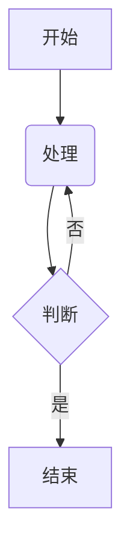

# Markdown 测试文档

## 基础语法测试

### 段落与换行
这是普通文本段落，在 Markdown 中只需简单书写。  
通过两个空格或反斜杠实现换行  
这是新的一行

### 文字强调
**加粗文本**  
*斜体文本*  
~删除线文本~~  
==高亮文本==（需扩展支持）  
`行内代码`

### 列表
#### 无序列表
- 项目一
- 项目二
  - 子项目 2.1
  - 子项目 2.2

#### 有序列表
1. 第一项
2. 第二项
   1. 子项 2.1
   2. 子项 2.2

#### 任务列表
- [ ] 未完成任务
- [x] 已完成任务

### 链接与图片
[普通链接](https://example.com)  
  
带标题的图片：  


### 引用
> 一级引用文本
>> 嵌套引用文本
>
> - 引用中的列表项
> - 另一个列表项

## 高级语法测试

### 代码块
```javascript
function hello() {
  console.log("Hello, Markdown!");
}
```

```python
def main():
    print("Python code block")
```

### 表格
| 左对齐 | 居中对齐 | 右对齐 |
| :----- | :------: | -----: |
| 单元格 |  单元格  |  单元格 |
| 长文本示例 | 居中测试 | 100 |

### 数学公式（需扩展支持）
$$
f(x) = \int_{-\infty}^\infty \hat f(\xi)\,e^{2 \pi i \xi x} \,d\xi
$$

### 脚注
这是一个带脚注的示例[^1]

[^1]: 这里是脚注内容

### 分割线
---

***

___

## 扩展语法测试

### 定义列表
术语一
: 定义描述一

术语二
: 定义描述二

### 流程图（需扩展支持）


### 注释
<!-- 这是不可见的注释 -->
```
